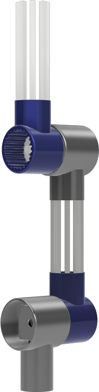
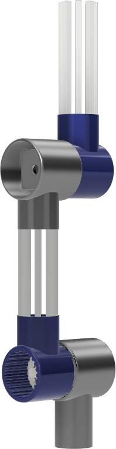
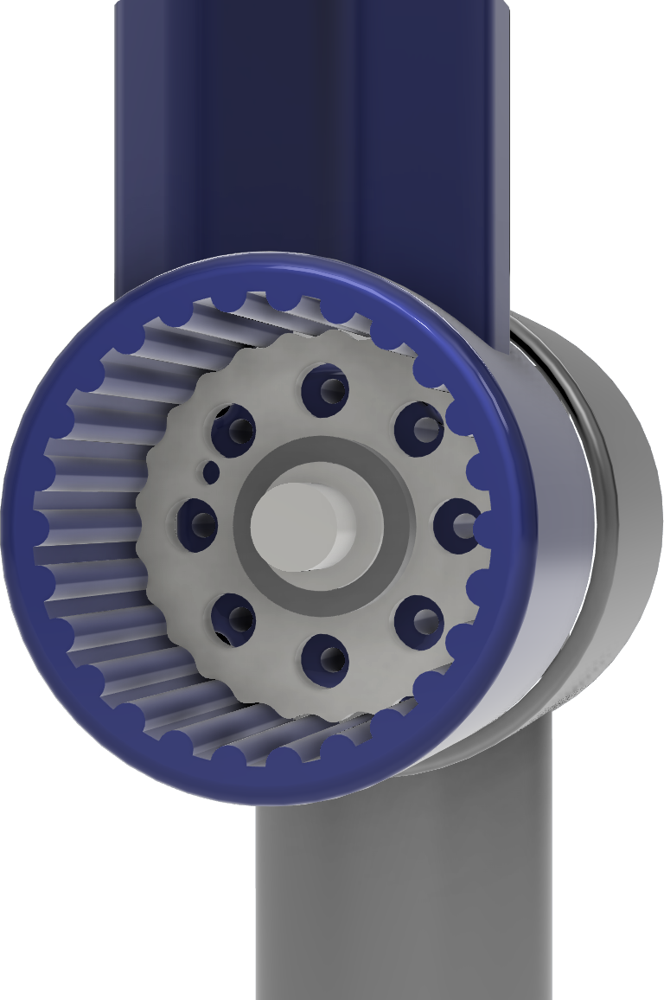

 
  <ul style="list-style: none;">
    

  <h1>BowBot</h1>
    

  </ul>

---

Meet the violin-playing robotic arm! With joints that move like a human’s, sensors that feel pressure and vibration, and software that reads music, this arm can bow, finger, and play complex pieces.

How-to videos coming soon!

> [!TIP]
> Latest CAD files available [here](https://github.com/ved-patel226/BowBot/releases/latest)

 
  <ul style="list-style: none;">
    

      <h2>Renders</h2>
    

  </ul>

---

<<<<<<< HEAD

  

      
    
  

  

=======

  
  

  

>>>>>>> 00d31730686c38a56f0d675b326db8bad17f1bdc

---

 
  <ul style="list-style: none;">
      

        <h2>
          <a href="https://www.societyofrobots.com/robot_arm_calculator.shtml" style="text-decoration: none; color: inherit;">
            Torque and Load Analysis
          </a>
        </h2>
      

  </ul>

  
  
  
  
  

---

