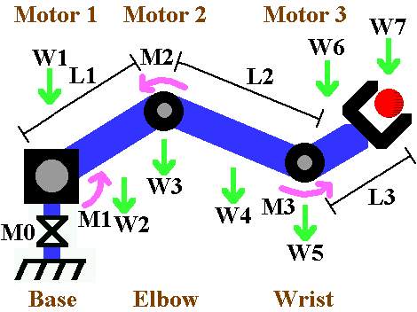
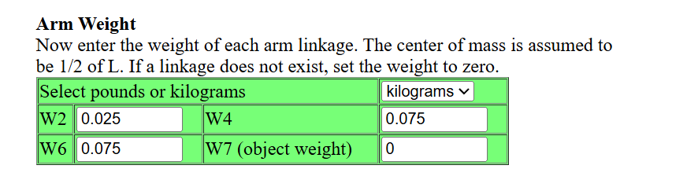
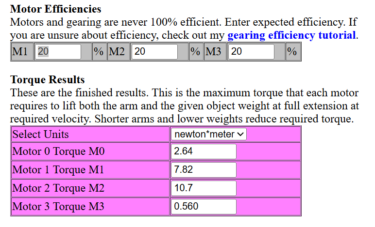
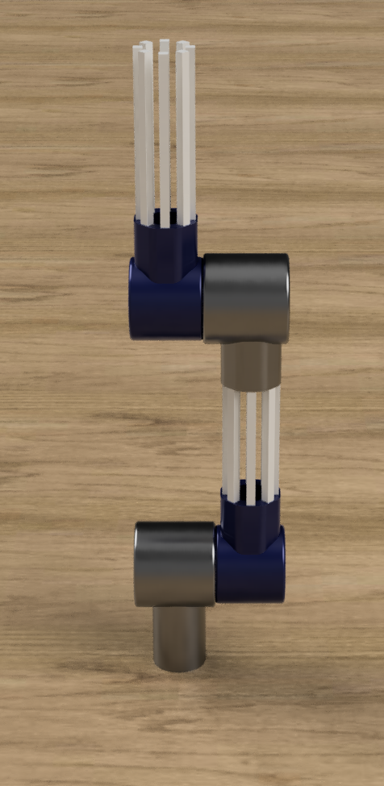
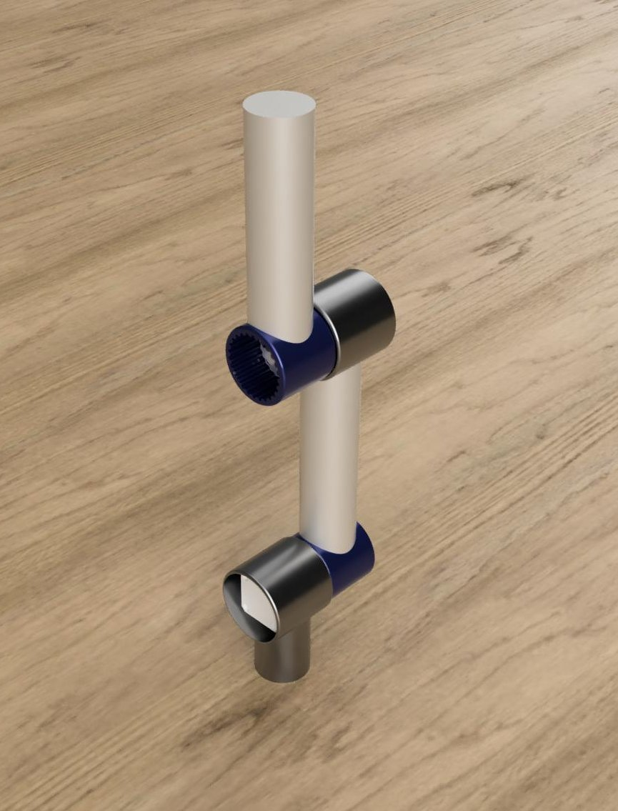

# BowBot

Meet the violin-playing robotic arm! With joints that move like a human’s, sensors that feel pressure and vibration, and software that reads music, this arm can bow, finger, and play complex pieces.

How-to videos coming soon!

## > [!TIP]

> Latest CAD files available [here](https://github.com/ved-patel226/BowBot/releases/latest)

## Torque and Load Analysis ([Robot Arm Calculator](https://www.societyofrobots.com/robot_arm_calculator.shtml))

  
  
  
  
  

## 1.0.0 (10/13/25) -> (10/18/25):

  
10/18/25 - Arm Render

  

  
10/13/25 - Arm Render

  

